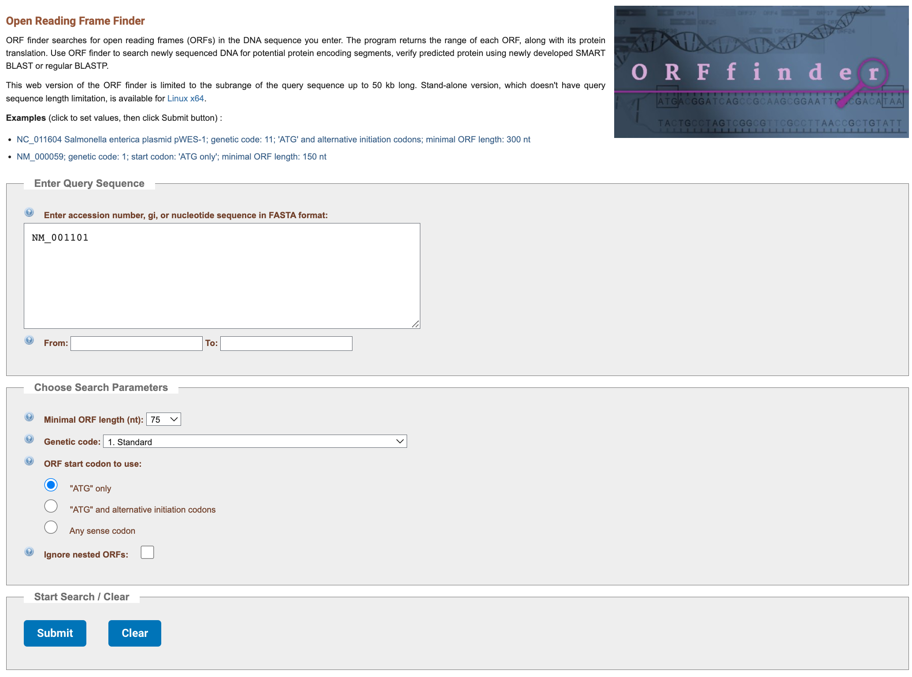
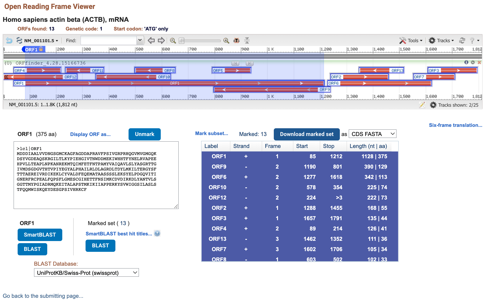

```{r setup, include=FALSE}
knitr::opts_chunk$set(echo = TRUE)
```

## Introduction

This notebook describes the point-and-click process followed on the
[NIH Open Reading Frame Finder][nih-orf-finder] site to produce a FASTA file
that contains a number of predicted open reading frames (ORFs) for the ACTB
gene.

## Workflow

After navigating to the [NIH Open Reading Frame Finder][nih-orf-finder] site,
the text box was used to query the accession number "NM_001101" (without
quotation marks).

All other paramaters were left as default, namely:

- "From" and "To" were left blank: we did not limit the search to any subset of
  the query sequence.
- The minimal ORF length was left to 75 nucleotides.
- The standard genetic code was used.
- Only ORF starting with the "ATG" were considered.
- Nested ORFs were not ignored (i.e., accepted).



Having clicked the "Submit" button, the result page reported 13 ORFs found.

On the result page, next to the button "Download marked set",
the "Mark subset..." button was clicked and the option
"AllORFs" was selected (all ORFs became highlighted with a blue background),
and the dropdown menu initially set to "Protein FASTA"
was clicked to select the option "CDS FASTA" instead.
Finally, the button "Download marked set" was clicked and the downloaded file
was renamed "actb_orfs.fasta".



[nih-orf-finder]: https://www.ncbi.nlm.nih.gov/orffinder/
