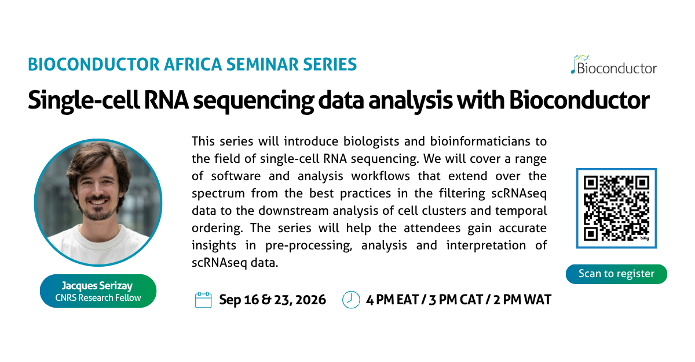

## Overview

::: {.bioc-africa-overview}

::: {.bioc-africa-overview-text}
The Bioconductor Africa Seminar Series is an online seminar series highlighting the use of Bioconductor for biological data analysis, with a focus on topics relevant to researchers across Africa and beyond.

The series includes introductory and thematic sessions led by members of the Bioconductor community, and is open to anyone interested in Bioconductor and related workflows.

**Series coordination:** Laurah Nyasita Ondari (IITA, Kenya)
:::

::: {.bioc-africa-overview-logo}
{fig-alt="Bioconductor Africa logo"}
:::

:::

## Upcoming seminars

### Featured seminar

{width="85%" fig-alt="Multiomics data integration with Bioconductor poster"}

- Date: 16 September and 23 September 2026  
- Time: 4 PM EAT / 3 PM CAT / 2 PM WAT  
- Presenters: Dr Jacques Serizay (CNRS)

This series of sessions explore how to analyse single-cell RNA sequencing data using Bioconductor.

[Register to attend](https://us06web.zoom.us/meeting/register/J8zlMhDfRuWCTBT0Fv7fNg) 

### Bioconductor Africa calendar

View upcoming Bioconductor Africa seminars in [Bioconductor TeSS](https://bioconductor.tesshub.org/events?q=Bioconductor+Africa+Seminar+Series).

You can also subscribe to the [Bioconductor Africa seminar calendar](https://bioconductor.tesshub.org/events.ics?q=Bioconductor+Africa+Seminar+Series) so that future seminars and updates appear automatically in your calendar.

- **Google Calendar:** use `Other calendars → From URL` and paste the calendar URL above.
- **Outlook:** in Outlook on the web, select `Calendar → Add calendar → Subscribe from web` and paste the calendar URL above.

  <h2>Stay connected with Bioconductor Africa</h2>
  
Sign up to receive seminar links, reminders, and announcements about future Bioc Africa activities.

  <iframe width="540" height="400" src="https://d6c3e9a4.sibforms.com/v2/serve/MUIFAEf-faI_b5GSXtvE9-8r7P1fLTphRP-w4G1b_bzra0c1SQBUxXBwDjVps63lFt9aRYWkunqxhxemNuC_SZ21PIHK0jMQiop0w9bY8y35qPeimM4zc_HBNEKw1V0ywe8ys2fCzUCKo2z70vNrrkpBAgdiN0wjJLn7Rw51MAXvJUnISTiFEdZOvgeWWlJlqutXa3EHSHp0IQDwUg==" frameborder="0" scrolling="auto" allowfullscreen style="display: block;margin-left: auto;margin-right: auto;max-width: 100%;"></iframe>

## Past seminars

Curious what the Bioconductor Africa seminars are like?  
Recordings from previous sessions are available below.  
If you're new to Bioconductor, you may want to start with the introductory session.

### Multi-omics data integration with Bioconductor

- Date: 12 August 2026
- Presenters: Dr Himel Mallick and Nalin Arora (Cornell University)

This session explored how multiple layers of biological data including genomics, transcriptomics, proteomics, metabolomics, and microbiome data can be integrated using statistical and machine learning approaches to uncover disease mechanisms, identify biomarkers, and improve biological discovery.

  <iframe
    width="100%"
    style="aspect-ratio: 16 / 9;"
    src="https://www.youtube.com/embed/N2W3jobpAqM?si=q6giZ6w-H14kEPjW" 
    title="Multi-omics data integration with Bioconductor"
    frameborder="0"
    allowfullscreen>
  </iframe>

Session notes: [Multi-omics data integration notes](https://annuel2.framapad.org/p/multiomics-12-08-2026)

### GWAS data analysis series

A two-part series exploring GWAS data analysis with the GENESIS package.

#### GWAS data analysis with GENESIS (Part 2)

- Date: 29 July 2026  
- Presenter: Stephanie Gorgaten (PRIMED and GREGoR)

In this second session, Stephanie focused on population structure, relatedness, and advanced association analyses in Bioconductor. Topics included computing genomic relationship matrices (GRMs), estimating relatedness with PC-Relate, fitting mixed-model null models, performing single-variant association tests, annotating and filtering variants, and conducting aggregate association tests.

  <iframe
    width="100%"
    style="aspect-ratio: 16 / 9;"
    src="https://www.youtube.com/embed/r6yJOwcSMm0?si=Dudcgv1DSifACY7b" 
    title="GWAS data analysis with GENESIS"
    frameborder="0"
    allowfullscreen>
  </iframe>

Session notes: [Gwas data analysis part 2](https://annuel2.framapad.org/p/gwas_data_analysis_using_genesis_part_2)

#### GWAS data analysis with GENESIS (Part 1)

- Date: 22 July 2026  
- Presenter: Stephanie Gorgaten (PRIMED and GREGoR)

In this first session, Stephanie covered foundations of GWAS analysis in Bioconductor. Topics included the GDS data format, converting and exploring genomic datasets, and conducting association analyses through null models, single-variant tests, and sliding window tests.

  <iframe
    width="100%"
    style="aspect-ratio: 16 / 9;"
    src="https://www.youtube.com/embed/AoRMlr5IRDU?si=6r5BqAZZ95gHd40E" 
    title="GWAS data analysis with GENESIS"
    frameborder="0"
    allowfullscreen>
  </iframe>

Session notes: [Gwas data analysis part 1](https://annuel2.framapad.org/p/gwas-data-analysis-using-genesis)

### CRISPR amplicon sequencing analysis using the ampliCan package

- Date: 17 June 2026
- Presenter: Kornel Labun (University of Warsaw)

This session explored how Bioconductor supports CRISPR amplicon sequencing analysis using the ampliCan package. It covered practical workflows for analysing genome editing outcomes, generating automated reports, and estimating homology-directed repair (HDR).

  <iframe
    width="100%"
    style="aspect-ratio: 16 / 9;"
    src="https://www.youtube.com/embed/rPRgX_2ezCA" 
    title="CRISPR Amplicon Sequencing Analysis with ampliCan"
    frameborder="0"
    allowfullscreen>
  </iframe>

Session notes: [Crispr analysis with amplican notes](https://annuel2.framapad.org/p/CRISPR_Amplicon_Analysis_with_ampliCan)

### Microbiome analysis series

A three-part series exploring microbiome data analysis workflows in Bioconductor.

#### Orchestrating Microbiome Analysis with Bioconductor (Part 3)

- Date: 20 May 2026  
- Presenter: Tuomas Borman (University of Turku, Finland)

This session focuses on reproducible reporting and workflow integration for microbiome analysis using Bioconductor.

  <iframe
    width="100%"
    style="aspect-ratio: 16 / 9;"
    src="https://www.youtube.com/embed/OFDn8dTg0LY"
    title="Orchestrating Microbiome Analysis with Bioconductor (Part 3)"
    frameborder="0"
    allowfullscreen>
  </iframe>

Session notes: [OMA part 3 notes](https://annuel2.framapad.org/p/bioc-africa-mia-analysis)

#### Orchestrating Microbiome Analysis with Bioconductor (Part 2)

- Date: 13 May 2026
- Presenter: Tuomas Borman (University of Turku, Finland)

This session demonstrates an end‑to‑end microbiome analysis workflow starting from abundance counts.

  <iframe
    width="100%"
    style="aspect-ratio: 16 / 9;"
    src="https://www.youtube.com/embed/HxCjozr0DZ0"
    title="Orchestrating Microbiome Analysis with Bioconductor (Part 2)"
    frameborder="0"
    allowfullscreen>
  </iframe>

Session notes: [OMA part 2 notes](https://annuel2.framapad.org/p/bioc-africa-mia-analysis)

#### Orchestrating Microbiome Analysis with Bioconductor (Part 1)

- Date: 6 May 2026
- Presenter: Tuomas Borman (University of Turku, Finland)

This session introduces the microbiome analysis ecosystem and data containers.

  <iframe
    width="100%"
    style="aspect-ratio: 16 / 9;"
    src="https://www.youtube.com/embed/7Y6E7g_Xx3U"
    title="Orchestrating Microbiome Analysis with Bioconductor (Part 1)"
    frameborder="0"
    allowfullscreen>
  </iframe>

Session notes: [OMA part 1 notes](https://annuel2.framapad.org/p/bioc-africa-mia-analysis)

### Introduction to Bioconductor

- Date: 15 April 2026
- Presenter: Kevin Rue-Albrecht (University of Oxford, UK)

This introductory session provides an overview of the Bioconductor project and ways to get involved in the community.

  <iframe
    width="100%"
    style="aspect-ratio: 16 / 9;"
    src="https://www.youtube.com/embed/ZbwOvgVTWF8"
    title="Introduction to Bioconductor – Bioconductor Africa Seminar Series"
    frameborder="0"
    allowfullscreen>
  </iframe>

Session notes: [Introduction to Bioconductor notes](https://annuel2.framapad.org/p/intro-to-bioconductor-15-april-2026)

## Format and recordings

- Seminars are held online.
- Registration is required to receive the live link.
- Where possible, recordings and slides will be shared after the session.

## Get involved

If you are interested in:

- giving a seminar,
- suggesting topics, or 
- contributing to Bioconductor Africa activities,

please get in touch via the [Bioconductor Zulip](https://chat.bioconductor.org) #bioc_africa channel or by direct message.

## Support and funding

The Bioconductor Africa Seminar Series is supported by the Bioconductor community and funded in part by the Chan Zuckerberg Initiative through the Essential Open Source Software for Science (EOSS) Cycle 6 programme.

This work forms part of Bioconductor’s broader efforts to expand global training, community engagement, and capacity building.

For more details on the funded projects, see:
- [Bioconductor projects funded by CZI EOSS Cycle 6](https://blog.bioconductor.org/posts/2024-07-12-czi-eoss6-grants/)

Bioc Africa activities are developed in collaboration with partners and contributors across the Bioconductor community and African research institutions.
