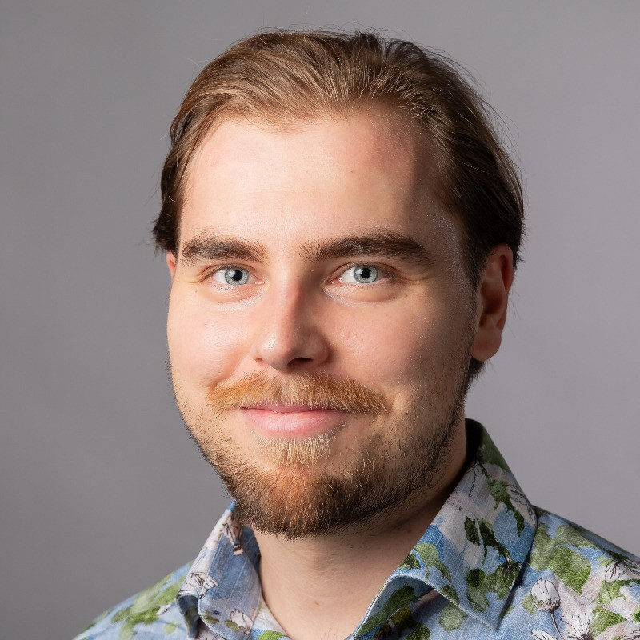
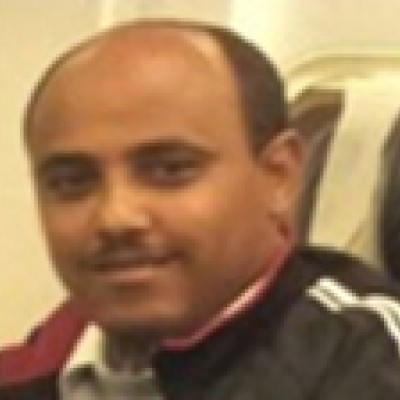
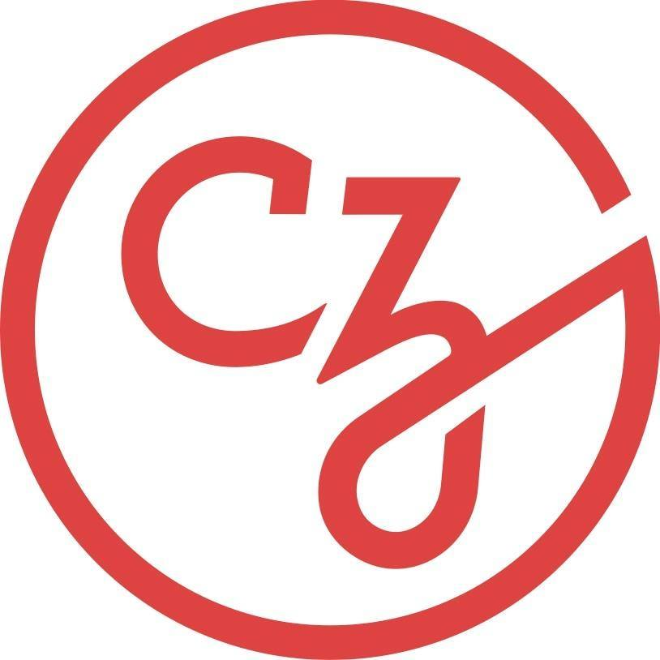

# Bioconductor Microbiome Course | Addis Ababa, Ethiopia | November 2026

{style="width:100%; height:calc(60vh + 50px); object-fit:cover; object-position:50% 5%; display:block; margin:0 auto;"}

## Event Details

- 📅 **Dates:** November 23 - 27, 2026
- 📍 **Location:** [Bio & Emerging Technology Institute (BETin)](https://www.betin.gov.et/), Addis Ababa, Ethiopia
- 📘 **Format:** Week-long course (single registration covering all sessions)

## Overview

This week-long workshop will explore how Bioconductor supports microbiome data science through modular and interoperable workflows. Participants will be guided through practical examples of how to analyse, manage, and reproducibly report complex microbiome data using R.

[Download the workshop flyer (PDF)](Ethiopia Workshop Flyer.png).  

## Course Structure

Participants will learn how to:

- Import, process, and analyze microbiome datasets
- Explore diversity patterns
- Perform differential abundance analyses
- Integrate multi-omics data

The course combines lectures with practical exercises to give participants the skills and confidence to run common microbiome analysis workflows independently using freely available resources.

**Prerequisites**: Familiarity with R and Bioconductor

> 📝 **Curious about what to expect?**  
> Browse the [Orchestrating Microbiome Analysis book](https://bioconductor.org/books/release/OMA/) for an overview of the course topics, and watch the [Bioconductor Africa seminar series](https://www.youtube.com/watch?v=r6yJOwcSMm0&list=PLdl4u5ZRDMQQC8qWAmAtHvWF6iHHvBp6a) to see demonstrations of many of the methods covered.

## 🎓 Instructors

The workshop will be led by a team of instructors from the Bioconductor community, including both local bioinformatics experts and experienced international instructors. This blend ensures a diversity of perspectives and expertise, fostering a strong collaborative learning environment.  

::: {.grid style="display: grid; grid-template-columns: repeat(4, 1fr); gap: 20px; max-width: 1000px; margin: auto;"}

::: {.text-center style="display: flex; flex-direction: column; align-items: center; text-align: center;"}
{width=120 height=120 style="border-radius:50%;"} 

  **Yohannes Gedamu**  
  <em style="font-size: 14px; color: #555;">BETin, Ethiopia</em>

  <a href="https://www.linkedin.com/in/yohannesgg/" target="_blank" style="display: flex; align-items: center; gap: 5px; text-decoration: none; color: inherit;">
     LinkedIn
  </a>

:::

::: {.text-center style="display: flex; flex-direction: column; align-items: center; text-align: center;"}
{width=120 height=120 style="border-radius:50%;"} 

  **Tuomas Borman**  
  <em style="font-size: 14px; color: #555;">Univeristy of Turku, Finland</em>

  <a href="https://www.linkedin.com/in/tuomasborman/" target="_blank" style="display: flex; align-items: center; gap: 5px; text-decoration: none; color: inherit;">
     LinkedIn
  </a>

:::

::: {.text-center style="display: flex; flex-direction: column; align-items: center; text-align: center;"}
{width=120 height=120 style="border-radius:50%;"} 

  **Trushar Shah**  
  <em style="font-size: 14px; color: #555;">IITA, Kenya</em>

  <a href="https://www.linkedin.com/in/trushar-shah-55416a1/" target="_blank" style="display: flex; align-items: center; gap: 5px; text-decoration: none; color: inherit;">
     LinkedIn
  </a>

:::

::: {.text-center style="display: flex; flex-direction: column; align-items: center; text-align: center;"}
{width=120 height=120 style="border-radius:50%;"} 

  **Zewdu Edea**  
  <em style="font-size: 14px; color: #555;">BETin, Ethiopia</em>

  <a href="https://www.linkedin.com/in/zewdu-edea-b7b051234/" target="_blank" style="display: flex; align-items: center; gap: 5px; text-decoration: none; color: inherit;">
     LinkedIn
  </a>

:::

:::

## Application

- **Cost:** Free (participants are responsible for their own travel and accommodation)
- **Application Deadline:** Rolling admissions starting August 10, 2026

➡️ [Apply for a place using the application form](https://forms.gle/fomF2RvZq24M6dEo6). 

We welcome applications from individuals who are eager to build their bioinformatics skills in microbiome data analysis using R and Bioconductor.

Applications will be reviewed based on motivation, background, and potential to apply the training.

Please apply only if you are committed to attending all sessions in person and can cover your travel and accommodation costs.

## Funding and Support

This workshop is primarily funded by BETin, with additional support from Bioconductor via a [Chan Zuckerberg Initiative (CZI) EOSS Cycle 6 grant](https://blog.bioconductor.org/posts/2024-07-12-czi-eoss6-grants/).

## Organisers

Zewdu Edea (Bio & Emerging Technology Institute), Yohannes Gedamu (Bio & Emerging Technology Institute), Trushar Shah (International Institute of Tropical Agriculture), Tuomas Borman (University of Turku), Maria Doyle (University of Limerick).

## Contact

For questions, please contact the local organising team (details in the [application form](https://forms.gle/fomF2RvZq24M6dEo6)), or email maria.doyle [at] ul.ie.

  <h2>🌍 Join the Bioconductor Africa Community</h2>
  
Stay informed about course registration opening, news, projects, and events in Africa.

  <iframe width="500" height="400" src="https://d6c3e9a4.sibforms.com/v2/serve/MUIFAEf-faI_b5GSXtvE9-8r7P1fLTphRP-w4G1b_bzra0c1SQBUxXBwDjVps63lFt9aRYWkunqxhxemNuC_SZ21PIHK0jMQiop0w9bY8y35qPeimM4zc_HBNEKw1V0ywe8ys2fCzUCKo2z70vNrrkpBAgdiN0wjJLn7Rw51MAXvJUnISTiFEdZOvgeWWlJlqutXa3EHSHp0IQDwUg==" frameborder="0" scrolling="no" allowfullscreen style="display: block;margin-left: auto;margin-right: auto;max-width: 100%;"></iframe>

  
  
  
  
  
  
  

