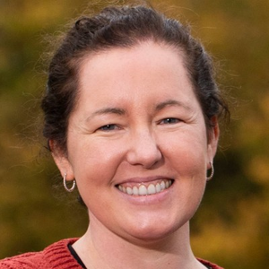
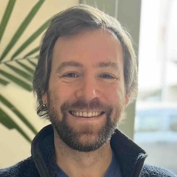
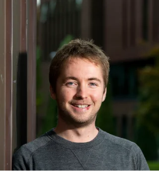
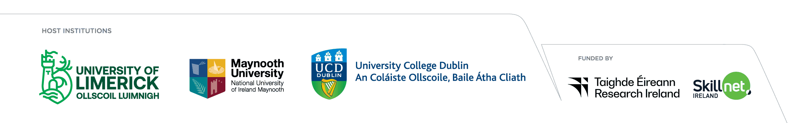

# Bioconductor for Data Science Workshop | Limerick, Ireland | 20 October 2026

*Delivered in partnership with the Research Ireland Centre for Research Training in Foundations of Data Science.*

## Event Details

- 📅 **Date:** 20 October 2026
- 📍 **Location:** Castletroy Park Hotel, Limerick
- 🕐 **Time:** 11:00–16:00
- 🎓 **Audience:** Research Ireland CRT in Foundations of Data Science students, alumni and invited participants
- 💻 **Format:** In-person with hybrid participation available

## Overview

This workshop introduces the Bioconductor ecosystem through two real-world case studies designed for a data science audience.

Participants will explore how biological data presents unique analytical challenges and learn how Bioconductor supports reproducible and scalable data science workflows.

No prior biology or bioinformatics experience is assumed.

Topics include:

- Introduction to Bioconductor
- Wastewater surveillance data analysis
- Single-cell and complex biological data
- Reproducible workflows in R

## Agenda

*Schedule subject to minor changes.*

| Time | Session | Instructor |
|------|----------|------------|
| 11:00–11:15 | Introduction to Bioconductor | Maria Doyle |
| 11:15–13:00 | Wastewater Analysis | Nick Cooley |
| 13:00–14:00 | Lunch | |
| 14:00–15:45 | Single-Cell and Complex Data Analysis | Michael Lynch |
| 15:45–16:00 | Discussion and Wrap-up | All |

## Workshop Materials

Materials will be added here before the workshop.

### Installation

- Instructions (coming soon).

### Workshop Resources

- Introduction to Bioconductor (coming soon)
- Wastewater Analysis (coming soon)
- [Single-Cell and Complex Data Analysis](https://michaelplynch.github.io/foundations-of-single-cell-data-science/index.html)

## Instructors

::: {.grid style="display: grid; grid-template-columns: repeat(3, 1fr); gap: 20px; max-width: 1000px; margin: auto;"}

::: {.text-center style="display: flex; flex-direction: column; align-items: center; text-align: center;"}
{width=120 height=120 style="border-radius:50%;"} 

  **Maria Doyle**  
  <em style="font-size: 14px; color: #555;">Community Manager, Bioconductor</em>

:::

::: {.text-center style="display: flex; flex-direction: column; align-items: center; text-align: center;"}
{width=120 height=120 style="border-radius:50%;"} 

  **Nicholas Cooley**  
  <em style="font-size: 14px; color: #555;">Developer Engagement Lead, Bioconductor</em>

:::

::: {.text-center style="display: flex; flex-direction: column; align-items: center; text-align: center;"}
{width=120 height=120 style="border-radius:50%;"} 

  **Michael Lynch**  
  <em style="font-size: 14px; color: #555;">Postdoctoral Researcher, University of Limerick</em>

:::

:::

## Contact

For questions about the workshop, please contact Maria Doyle (maria.doyle [at] ul.ie).

## Organisers and Support

This workshop is delivered by the Bioconductor community in collaboration with the Research Ireland Centre for Research Training in Foundations of Data Science. Venue and catering are kindly supported by the CRT.

